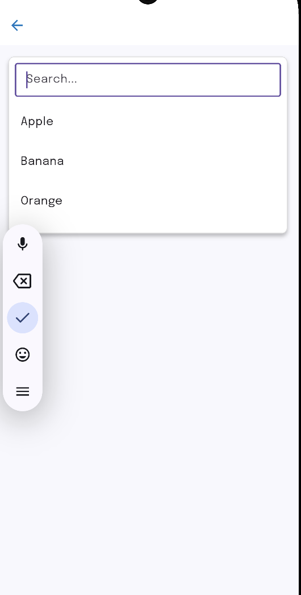

## 📸 Screenshots

| Single Select                                   | Multi Select                                  | With Search                            | With Search                                         |
|-------------------------------------------------|-----------------------------------------------|----------------------------------------|-----------------------------------------------------|
|  |  |  |  |


# 🧩 Custom Dropdown for Flutter

A **fully customizable dropdown widget** for Flutter that supports **single-select**, **multi-select**, and **search** — all in one widget.  
Lightweight, flexible, and easy to integrate into any Flutter project.

---

## 📱 Platform Support

| Platform | Supported | Tested |
|-----------|------------|---------|
| Android | ✅ | ✅ |
| iOS | ✅ | ✅ |
| Web | ✅ | ✅ |
| Windows | ✅ | ⚙️ |
| macOS | ✅ | ⚙️ |
| Linux | ✅ | ⚙️ |

> 💡 Works with **Flutter 3.0+** and **Dart 3.0+**

---

## ✨ Features

✅ **Single Select (default)** — behaves like a normal dropdown  
✅ **Multi Select** — users can select multiple items  
✅ **Searchable Dropdown** — optional search bar for filtering  
✅ **Flexible Decoration** — customize dropdown and list appearance  
✅ **Custom InputDecoration** for search bar  
✅ **Auto position below the button**  
✅ **Lightweight (~3 KB compressed)**  
✅ **No external dependencies**

---

## 🚀 Installation

Add to your .dart file:

```yaml
const Text('1️⃣ Default Dropdown (single select)'),
CustomDropdown(
  items: fruits,
  onChanged: (value) => setState(() => defaultSelected = value),
),


const Text('2️⃣ Single Select Dropdown'),
CustomDropdown(
  items: fruits,
  onChanged: (value) => setState(() => singleSelected = value),
),


const Text('3️⃣ Multi Select Dropdown'),
CustomDropdown(
  items: fruits,
  isMultiSelect: true,
  onChanged: (values) => setState(() => multiSelected = List<String>.from(values)),
),


const Text('4️⃣ Searchable Dropdown (single)'),
CustomDropdown(
  items: fruits,
  isSearch: true,
  onChanged: (value) => setState(() => decoratedSelected = value),
),


const Text('5️⃣ Searchable Dropdown (multi)'),
CustomDropdown(
  items: fruits,
  isSearch: true,
  isMultiSelect: true,
  onChanged: (values) => setState(() => searchSelected = List<String>.from(values)),
),


const Text('6️⃣ Custom Decorated Dropdown'),
CustomDropdown(
  items: fruits,
  isSearch: true,
  isMultiSelect: true,
  decoration: BoxDecoration(
    color: Colors.purple.shade50,
    borderRadius: BorderRadius.circular(16),
    border: Border.all(color: Colors.purple, width: 2),
  ),
  dropdownDecoration: BoxDecoration(
    color: Colors.white,
    borderRadius: BorderRadius.circular(16),
    boxShadow: [
      BoxShadow(
        color: Colors.purple.withValues(alpha: 0.3),
        blurRadius: 5,
        offset: const Offset(0, 3),
      ),
    ],
  ),
  inputDecoration: const InputDecoration(
    hintText: 'Search fruits...',
    border: OutlineInputBorder(),
    isDense: true,
  ),
  onChanged: (values) => setState(() => searchSelected = List<String>.from(values)),
),