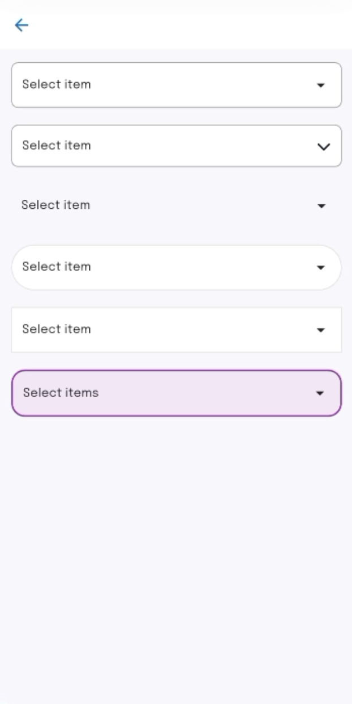
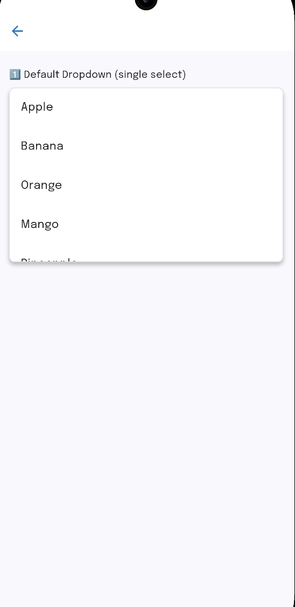
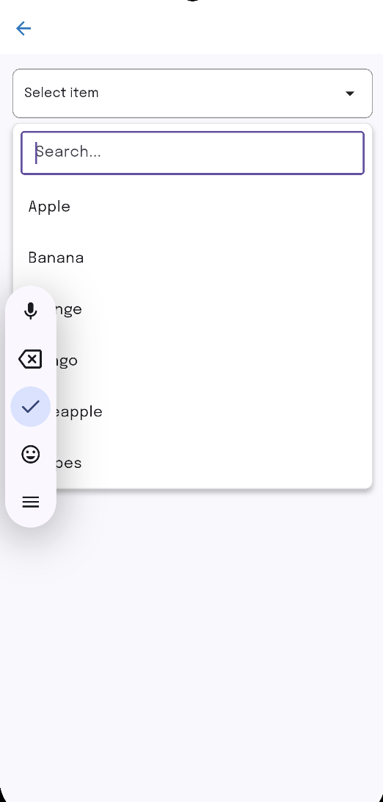
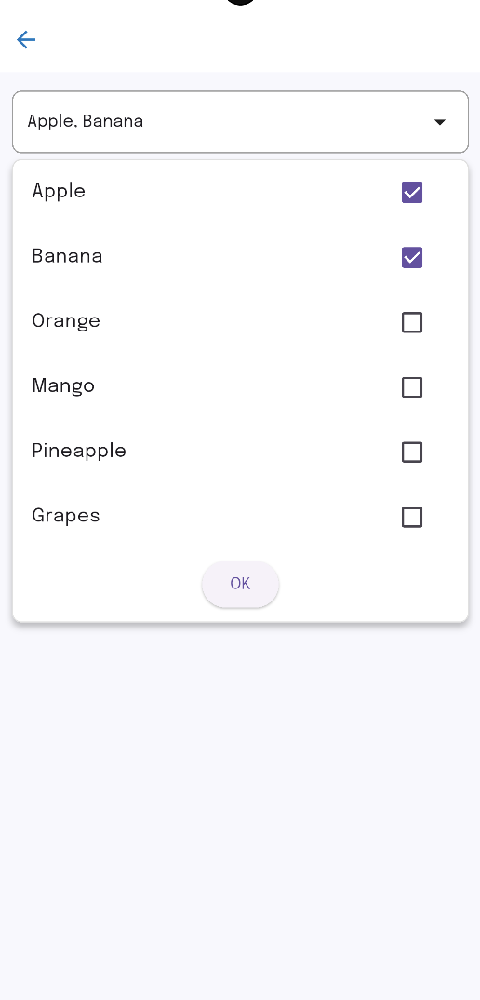
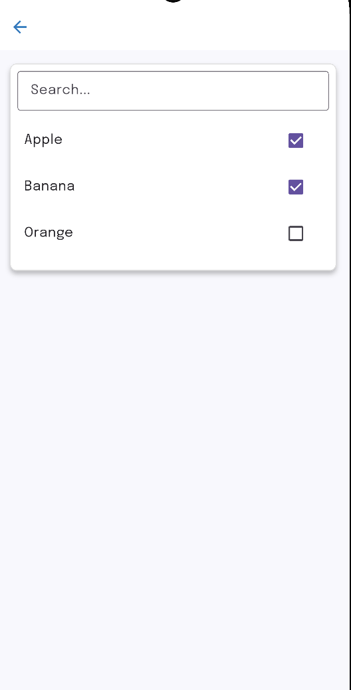

## 📸 Screenshots

| Custom Decoration                                       | Single Select                                   | Single Select with Search                                          | Multi Select                                  | Multi Select with Search                                         |
|---------------------------------------------------------|-------------------------------------------------|--------------------------------------------------------------------|-----------------------------------------------|------------------------------------------------------------------|
|  |  |  |  |  |

# 🧩 Custom Dropdown for Flutter

A **fully customizable dropdown widget** for Flutter that supports **single-select**, **multi-select**, and **search** — all in one widget.  
Lightweight, flexible, and easy to integrate into any Flutter project.

---

## 📱 Platform Support

| Platform | Supported | Tested |
|-----------|------------|---------|
| Android | ✅ | ✅ |
| iOS | ✅ | ✅ |
| Web | ✅ | ✅ |
| Windows | ✅ | ⚙️ |
| macOS | ✅ | ⚙️ |
| Linux | ✅ | ⚙️ |

> 💡 Works with **Flutter 3.0+** and **Dart 3.0+**

---

## ✨ Features

✅ **Single Select (default)** — behaves like a normal dropdown  
✅ **Multi Select** — users can select multiple items  
✅ **Searchable Dropdown** — optional search bar for filtering  
✅ **Flexible Decoration** — customize dropdown and list appearance  
✅ **Custom InputDecoration** for search bar  
✅ **Auto position below the button**  
✅ **Lightweight (~3 KB compressed)**  
✅ **No external dependencies**
✅ **Custom Dropdown Button Design**
✅ **Custom Dropdown Icon**

---

## ⚙️ Customization Options

Below is a complete list of customizable properties available in the **`AdvancedDropdown`** widget.

| Property | Type | Required | Default | Description |
|-----------|------|-----------|----------|-------------|
| **items** | `List<String>` | ✅ Yes | – | The list of items to display in the dropdown. |
| **onChanged** | `Function(dynamic)` | ✅ Yes | – | Callback triggered when an item is selected. Returns a value or list depending on selection mode. |
| **isSearch** | `bool` | ❌ No | `false` | Enables a search bar for filtering dropdown items. |
| **isMultiSelect** | `bool` | ❌ No | `false` | Enables multiple selection with checkboxes. |
| **decoration** | `BoxDecoration?` | ❌ No | `null` | Customizes the dropdown button (border, color, shape, etc.). |
| **dropdownDecoration** | `BoxDecoration?` | ❌ No | `null` | Styles the dropdown list container. |
| **inputDecoration** | `InputDecoration?` | ❌ No | `null` | Customizes the search text field decoration. |
| **hintText** | `String?` | ❌ No | `"Select an option"` | The text shown when no item is selected. |
| **selectedTextStyle** | `TextStyle?` | ❌ No | `null` | Custom text style for the selected item(s). |
| **itemTextStyle** | `TextStyle?` | ❌ No | `null` | Custom text style for each dropdown item. |
| **icon** | `Widget?` | ❌ No | `Icon(Icons.arrow_drop_down)` | Dropdown icon beside the button. |
| **key** | `Key?` | ❌ No | `null` | Flutter widget key for testing or identification. |

---

## 💡 Notes

- Default mode = **Single Select**
- When `isMultiSelect: true`, the `onChanged` callback returns a **List** of selected items.
- Dropdown automatically opens **below the button**.
- You can style **everything** (dropdown, button, list, search bar).
- Works seamlessly with **light** and **dark** themes.

---