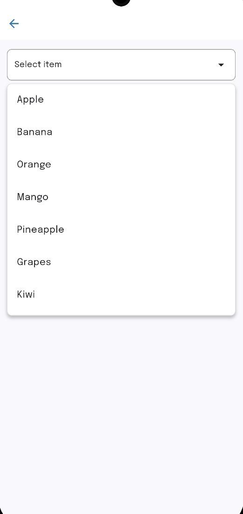

## 📸 Screenshots

| Custom Decoration                                       | Single Select                                   | Single Select with Search                                          | Multi Select                                  | Multi Select with Search                                         |
|---------------------------------------------------------|-------------------------------------------------|--------------------------------------------------------------------|-----------------------------------------------|------------------------------------------------------------------|
|  |  |  |  |  |

# 🧩 Custom Dropdown for Flutter

A **fully customizable dropdown widget** for Flutter that supports **single-select**, **multi-select**, and **search** — all in one widget.  
Lightweight, flexible, and easy to integrate into any Flutter project.

---

## 📱 Platform Support

| Platform | Supported | Tested |
|-----------|------------|---------|
| Android | ✅ | ✅ |
| iOS | ✅ | ✅ |
| Web | ✅ | ✅ |
| Windows | ✅ | ⚙️ |
| macOS | ✅ | ⚙️ |
| Linux | ✅ | ⚙️ |

> 💡 Works with **Flutter 3.0+** and **Dart 3.0+**

---

## ✨ Features

✅ **Single Select (default)** — behaves like a normal dropdown  
✅ **Multi Select** — users can select multiple items  
✅ **Searchable Dropdown** — optional search bar for filtering  
✅ **Flexible Decoration** — customize dropdown and list appearance  
✅ **Custom InputDecoration** for search bar  
✅ **Auto position below the button**  
✅ **Lightweight (~3 KB compressed)**  
✅ **No external dependencies**
✅ **Custom Dropdown Button Design**
✅ **Custom Dropdown Icon**

---

## ⚙️ Customization Options

Below is a complete list of customizable properties available in the **`AdvancedDropdown`** widget.

| Property                | Type                                            | Required | Default                       | Description                                                                                                                             |
|-------------------------|-------------------------------------------------|----------|-------------------------------|-----------------------------------------------------------------------------------------------------------------------------------------|
| **items**               | `List<dynamic>  List<Map<String, dynamic>>` | ✅ Yes    | –                             | The list of items to display in the dropdown. Supports both `List<String>` and `List<Map<String, dynamic>>`.                            |
| **onChanged**           | `Function(dynamic)`                             | ✅ Yes    | –                             | Callback triggered when an item (or multiple items) is selected. Returns a value (single select) or a list (multi-select).              |
| **isSearch**            | `bool`                                          | ❌ No     | `false`                       | Enables a search bar for filtering dropdown items.                                                                                      |
| **isMultiSelect**       | `bool`                                          | ❌ No     | `false`                       | Enables multiple selection mode with checkboxes and removable chips.                                                                    |
| **displayField**        | `String?`                                       | ❌ No     | `null`                        | For `List<Map<String, dynamic>>`, defines which key to use for display text (e.g., `"name"`).                                           |
| **valueField**          | `String?`                                       | ❌ No     | `null`                        | For `List<Map<String, dynamic>>`, defines which key to use as the actual value (e.g., `"id"`).                                          |
| **initialValue**        | `dynamic`                                       | ❌ No     | `null`                        | Defines a preselected value for **single-select** dropdowns — useful for restoring API data.                                            |
| **initialValues**       | `List<dynamic>?`                                | ❌ No     | `null`                        | Defines preselected values for **multi-select** dropdowns — useful for restoring API data or saved user preferences.                    |
| **maxSelection**        | `int?`                                          | ❌ No     | `null`                        | Sets a limit for maximum selected items in multi-select mode. When exceeded, shows a `SnackBar` (e.g., “You can select up to 4 items”). |
| **decoration**          | `BoxDecoration?`                                | ❌ No     | `null`                        | Customizes the main dropdown button appearance (border, background, shape, etc.).                                                       |
| **dropdownDecoration**  | `BoxDecoration?`                                | ❌ No     | `null`                        | Styles the dropdown popup container.                                                                                                    |
| **inputDecoration**     | `InputDecoration?`                              | ❌ No     | `null`                        | Customizes the search field’s style and behavior.                                                                                       |
| **hintText**            | `String?`                                       | ❌ No     | `"Select an option"`          | Text shown when no item is selected.                                                                                                    |
| **icon**                | `Icon?`                                         | ❌ No     | `Icon(Icons.arrow_drop_down)` | The dropdown icon displayed beside the field.                                                                                           |
| **selectedTextStyle**   | `TextStyle?`                                    | ❌ No     | `null`                        | Custom text style for displaying selected items.                                                                                        |
| **itemTextStyle**       | `TextStyle?`                                    | ❌ No     | `null`                        | Custom text style for dropdown list items.                                                                                              |
| **chipColor**           | `Color`                                         | ❌ No     | `Color(0xFFD0E6FF)`           | Background color for selected item chips (multi-select mode).                                                                           |
| **chipTextColor**       | `Color`                                         | ❌ No     | `Colors.black`                | Text color inside chips.                                                                                                                |
| **chipTextStyle**       | `TextStyle?`                                    | ❌ No     | `null`                        | Fully customize the chip’s text (font, size, weight, etc.).                                                                             |
| **chipRemoveIconColor** | `Color`                                         | ❌ No     | `Colors.black54`              | Color of the chip remove (×) icon.                                                                                                      |
| **key**                 | `Key?`                                          | ❌ No     | `null`                        | Flutter widget key for testing or identification.                                                                                       |

---

## 💡 Notes

- Default mode = **Single Select**
- When `isMultiSelect: true`, the `onChanged` callback returns a **List** of selected items.
- Dropdown automatically opens **below the button**.
- You can style **everything** (dropdown, button, list, search bar).
- Works seamlessly with **light** and **dark** themes.

---